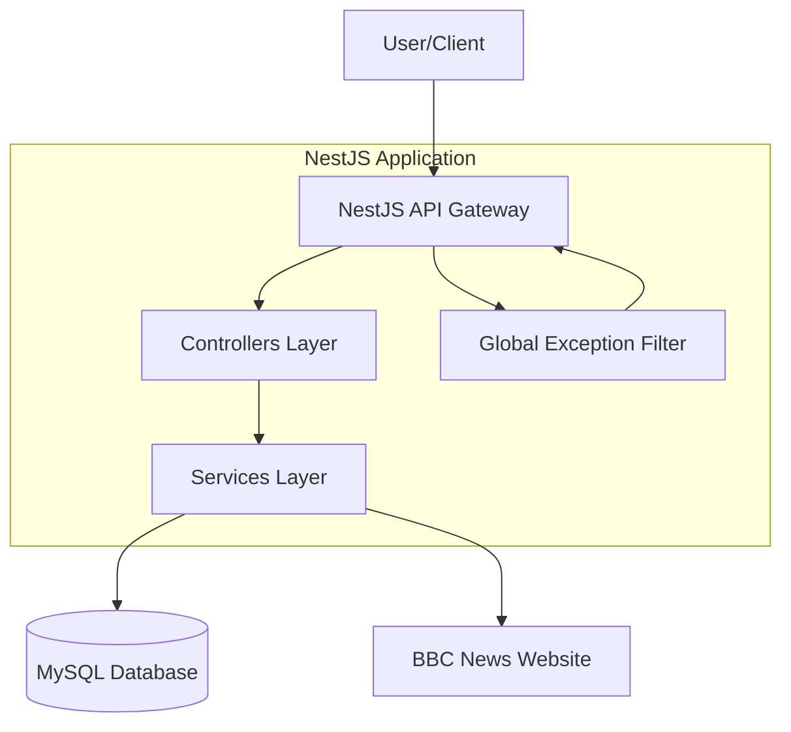
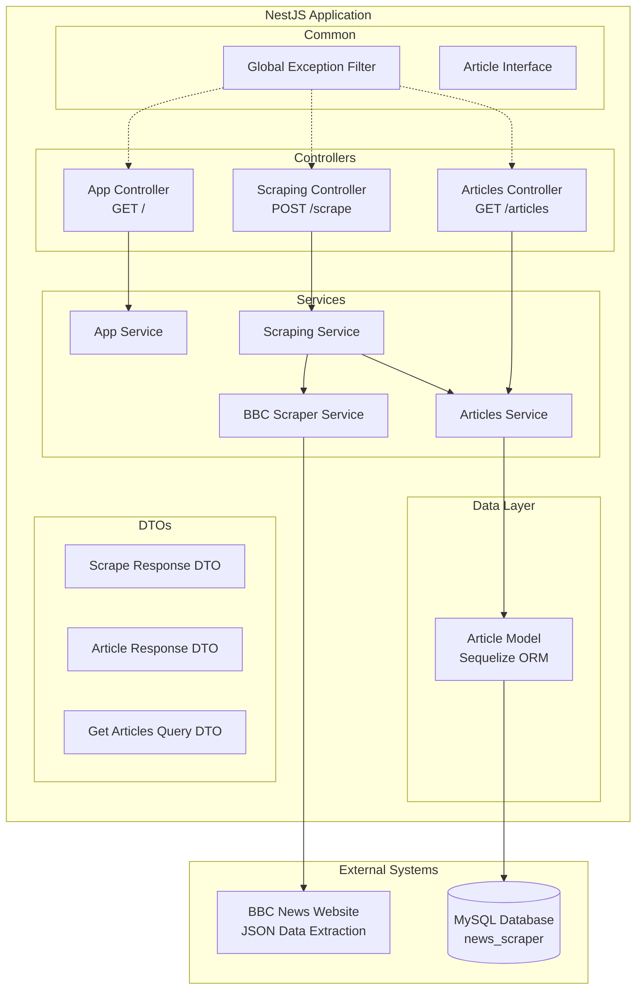
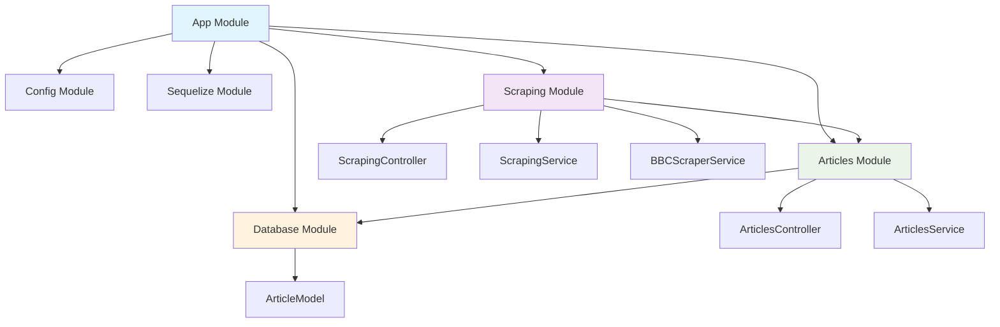
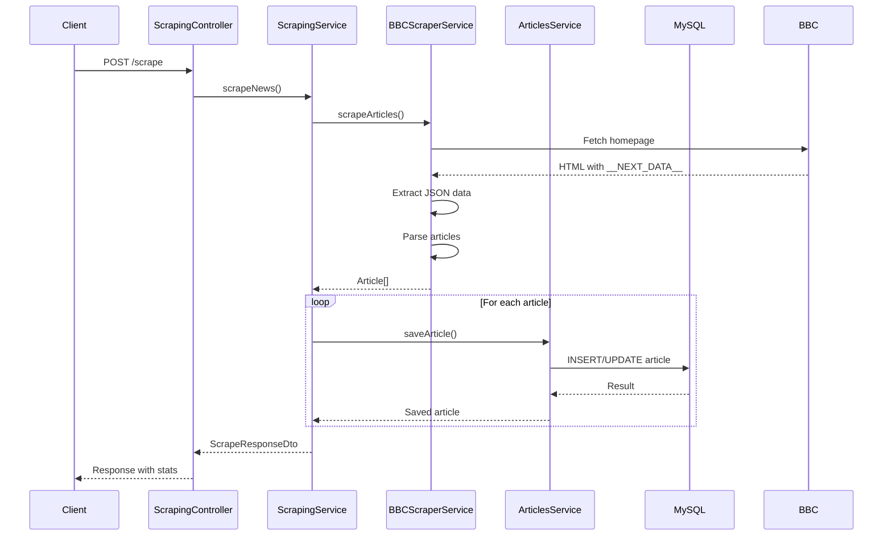
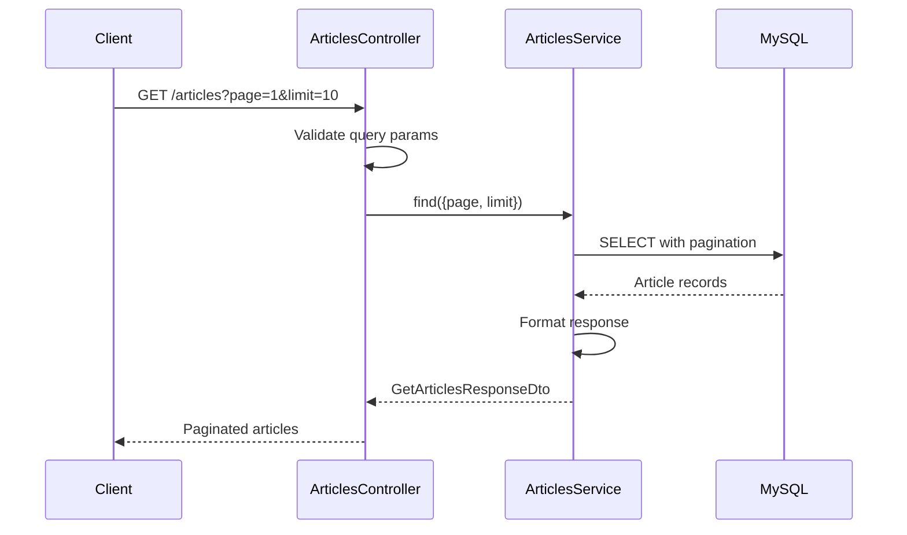
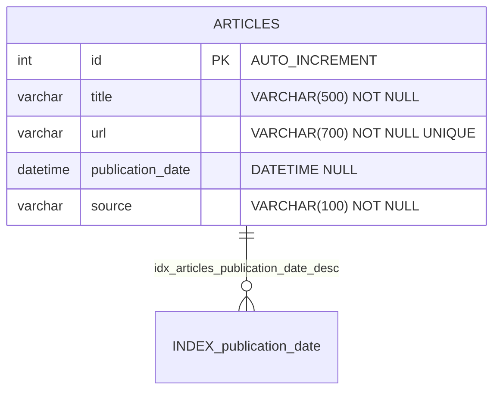
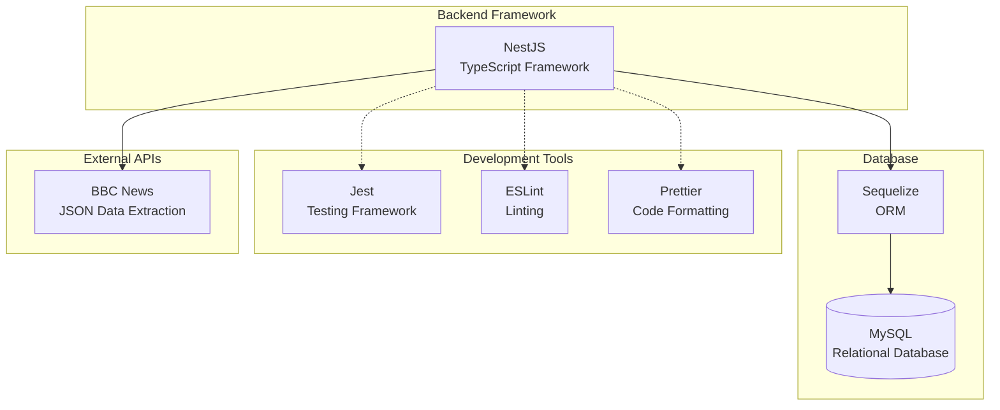

# News Scraper Architecture

This document provides a visual representation of the news scraper application architecture.

## System Overview

## Detailed Application Architecture

## Module Dependencies

## Data Flow - Scraping Process

## Data Flow - Articles Retrieval

## Database Schema

## Technology Stack

## API Endpoints

| Method | Endpoint | Description | Response |
|--------|----------|-------------|----------|
| GET | `/` | Health check | App status |
| POST | `/scrape` | Trigger news scraping | Scraping results |
| GET | `/articles` | Retrieve articles | Paginated articles list |

## Key Features

- **Advanced Scraping**: Extracts data from `__NEXT_DATA__` JSON embedded in BBC News pages
- **Duplicate Prevention**: URL-based uniqueness constraint prevents duplicate articles
- **Real Publication Dates**: Extracts actual publication timestamps from article metadata
- **Pagination Support**: Efficient pagination with configurable page size limits
- **Type Safety**: Comprehensive TypeScript interfaces and DTOs
- **Error Handling**: Global exception filter for centralized error management
- **Testing**: Unit tests with Jest for all major components